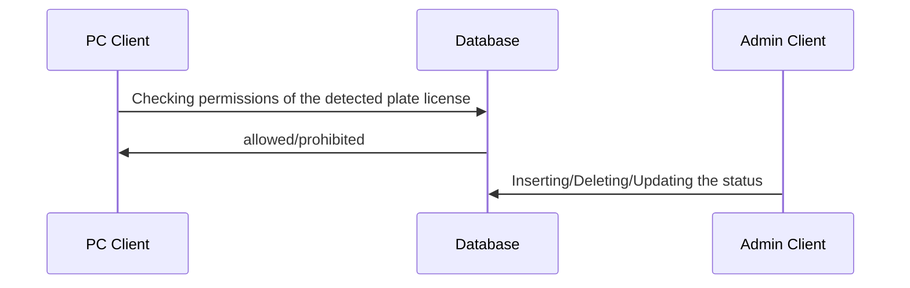

# Administration client for "Smart Parking project" 

This tool is administration client for the project "Smart Parking". 
With this tool the admin can:

 - Insert new cars that have a permission
 - Delete cars if their permission has bees expired
 - Update the status of the cars 

## UML project diagram 

